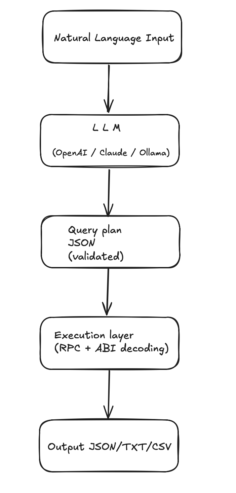

# ChainQL 🌱

[](https://github.com/deflang/chainql/stargazers)
[](https://www.npmjs.com/package/chainql)
[](https://pypi.org/project/chainql/)
[](https://github.com/deflang/chainql/actions)
[](./LICENSE)

**Natural language → Ethereum on-chain data, instantly.**

ChainQL is an MVP tool that lets developers query Ethereum blockchain data using simple English commands. No need to manually touch RPC endpoints, The Graph, or decode events — just type your query and get structured JSON or tables.

> ⭐ If you find ChainQL useful, please **star this repo**! Your support is crucial for our growth and helps us improve faster.

---

## 🚀 Why ChainQL?

Web3 development is hard. Developers face:

- **Infrastructure complexity:** managing nodes, wallets, and local test environments
- **Fragmented tooling:** incompatible chains, SDKs, and inconsistent documentation
- **High barrier to entry:** blockchain concepts, gas optimization, and smart contract security
- **Slow UX & scalability trade-offs:** network congestion, high gas fees
- **Security burden:** bugs can be costly, audits are expensive

ChainQL simplifies this by providing a natural language interface to blockchain data, letting developers focus on building instead of plumbing.

---

## 🌱 MVP Features (Ethereum Only)

### Core Functionality

- ✅ Natural language → structured query → on-chain data
  - Supported queries: Uniswap swaps, ERC20 transfers, ERC721 transfers
- ✅ Query planner via LLM (OpenAI, Claude, Ollama)
- ✅ Execution layer with RPC (Infura/Alchemy)
  - Event decoding with `ethers.js` / `web3.py`
  - Time & value filters
- ✅ Output in JSON by default, optional CLI tables

### Nice-to-Have (Polish)

- Web UI (Next.js) with textbox → JSON/table output
- Currency conversion (USD via Coingecko)
- Filters: Top-N, biggest/smallest transactions
- Basic pagination & export to JSON/CSV

### Developer Experience

- CLI: `npm i -g chainql` or `pip install chainql`
- Config system for LLM providers:
  ```bash
  chainql config --provider=openai --api-key=...
  chainql config --provider=ollama --model=llama3
  ```

## 🛠 Installation

```bash
npm install -g chainql
# or
pip install chainql
```

## 💻 Usage

```bash
chainql query "show me USDC transfers last 24h" --format table --limit 50

chainql query "top 5 Uniswap swaps today above 10000 USD" --format table

chainql query "show me BAYC NFT sales last 7 days" --format json
```

## Architecture

<div align="center">
  
</div>
